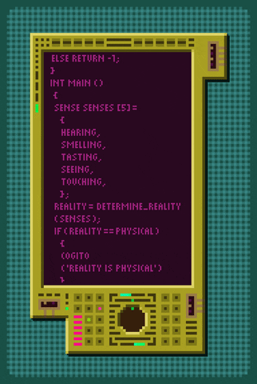

## Hi there👋

  

### I'm Isa
 <ul>
  <li>20y. </li>
  <li>Computer Science Student.</li>
 </ul>

  I use this GitHub to keep track of my career, showcasing my knowledge and skills.

  

🎓 College

  Projects made during college time.
    

- 🔸 [Aplicação em Java: Gestão de estoque | Inventory Management Application in Java ](https://github.com/JoaoHenriqueProg/A3-EmprestimoDeFerramentas)
- 🔸 [GameDev](https://github.com/y-leandro/Trabalho-A3-gamedev)

  

💾 Personal Projects

  Projects made during the process of learning new languages and features.
    

    
- 🔹 [Number Guessing Game in Python](https://github.com/isadahmerb/numberGuessing)
- 🔹 [Beginner C Projects](https://github.com/isadahmerb/projeCts)
- 🔹 [Bank Management System in C ](https://github.com/isadahmerb/CBank_ManagementSystem)

